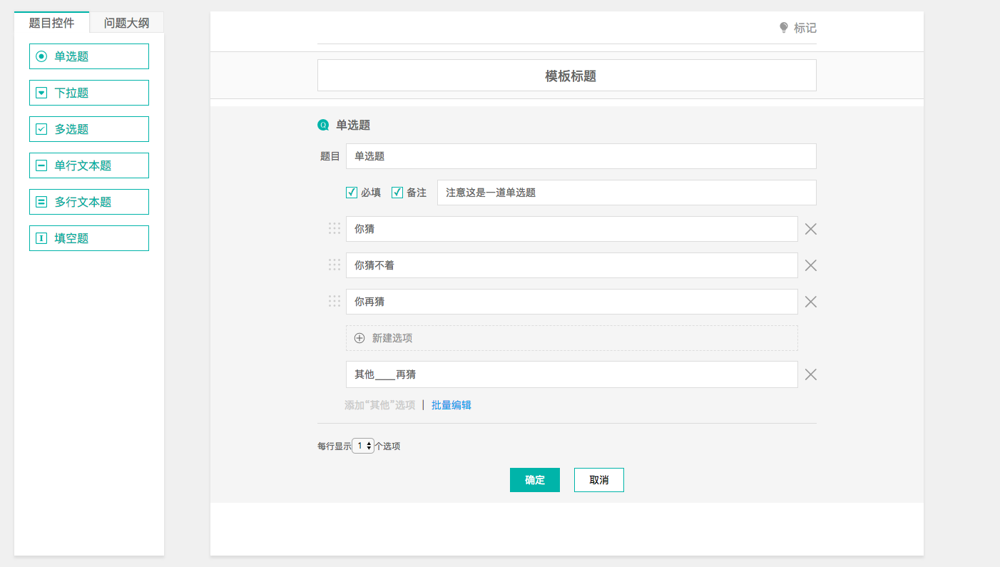

# react-questionnair

基于react开发的自定义问卷调查表。目前只支持单选题、下拉题、多选题、单行文本题、多行文本题、填空题六种基本题型。支持拖拽排序功能。

## 预览


## 安装 

    npm install react-questionnair

## Demo 开发

```shell
$ git clone https://github.com/pandly/react-questionnnair.git
$ cd react-questionnnair
$ npm install
$ npm run dev

```
[demo地址](https://pandly.github.io/react-questionnnair/dist/)

## 使用

```shell
import React from 'react'
import Questionnnair from 'react-questionnair'

<Questionnnair />   //编辑题目
<Questionnair.Editor />   //渲染题目
<Questionnair.Answer />   //渲染答案

```

## APIs

| 属性      | 描述                            |   类型   | 默认值 |
| --------- | :------------------------------ | :------: | :----: |
| editor | 编辑器数据结构                  |  array  |        |
| acitveAnswer | 编辑器组件为true时可以进行答案填写  |   boolean   |    false    |


| 事件       | 描述                            |   参数   |
| --------- | :------------------------------ | :------: |
| onDrag       | 当拖拽题目时会触发该事件（包括题目栏拖拽）  | array |
| onConfirm    | 当确认编辑题目时会触发该事件              | array |
| onCopy       | 当拷贝题目时会触发该事件                 | array |
| onRemove     | 当移除题目时会触发该事件                 | array |
| onSign       | 当标记问卷时会触发该事件                 | array |
| onSaveTitle  | 当问卷题目失焦时会触发该事件              | array |

## 数据结构

```
//可供选择的type类型
const type = {
	radio: '单选题',
	dropdown: '下拉题',
	checkbox: '多选题',
	text: '单行文本题',
	textarea: '多行文本题',
	input: '填空题'
}

//react-questionnair按照如下的数据结构约定一个编辑器，开发时可以按照如下的数据结构约定好
const editor = {
    questionId: uuid(), //id
    type: type, //类型，根据类型渲染出相应的题型
    title: '', //题目
    required: false, //是否必填
    remark: false, //是否有备注
    remarkText: '', //备注内容
    options: ['选项', '选项'], //选项(只有radio,checkbox,select有,其余尽量给个空数组)
    rows: 1, //选项占的行数
    textareaHeight: 3, //多行文本高度
    maxLength: 50, //单行文本限制的字数
    otherOption: false, //是否有其他选项
    otherOptionForwards: '其他', //”其他“项文本(前)
    otherOptionBackwards: '', //”其他“项文本(后)
    completionForwards: '题目：', //填空题文本(前)
    completionBackwards: '', //填空题文本(后)
    isEditor: true, //编辑状态还是已编辑状态
    isFirst: true, //是否是新创建的
    editorShake: ''
}

```

## 注意事项

* 题目编辑器都是循环`<Questionnair.Editor editor={editor} />`渲染出来的，react-questionnair的设计思路就是将编辑器数组状态提升，
  每次进行编辑器修改时(触发API事件)，都会反映在编辑器数组中，然后再重新渲染整个问卷表。与后端交互的话把最新的题目数组返回给后端保存就行。
  
* 其他模块需要编辑好的题目话，根据相应的id去后端取相应的题目`<Questionnair.Editor editor={editor} activeAnswer = {true}/>`渲染在页面上。

* 填写完题目以后再根据`<Questionnair.Answer editor={editor} />`组件渲染答案。
